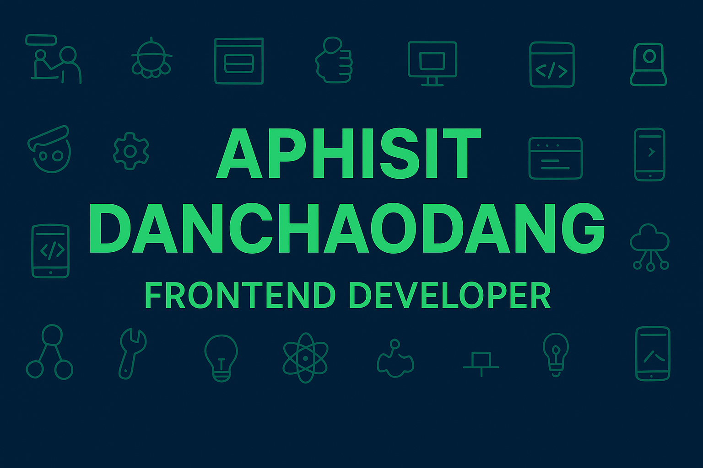

<!-- Banner -->

<h1 align="center">Hi 👋, I'm Aphisit Danchaodang</h1>
<h3 align="center">FullStack Web developer </h3>

---

- 🔭 I’m currently working on **[Your Project Name]**
- 🌱 I’m currently learning **React Native / Next.js**
- 💬 Ask me about **Android, MERN, or Web Development**
- 📫 How to reach me **yourmail@example.com**
- ⚡ Fun fact: **I love coding with coffee ☕**

---

### 🌐 Connect with me:

---

### 🛠️ Languages and Tools:

---
